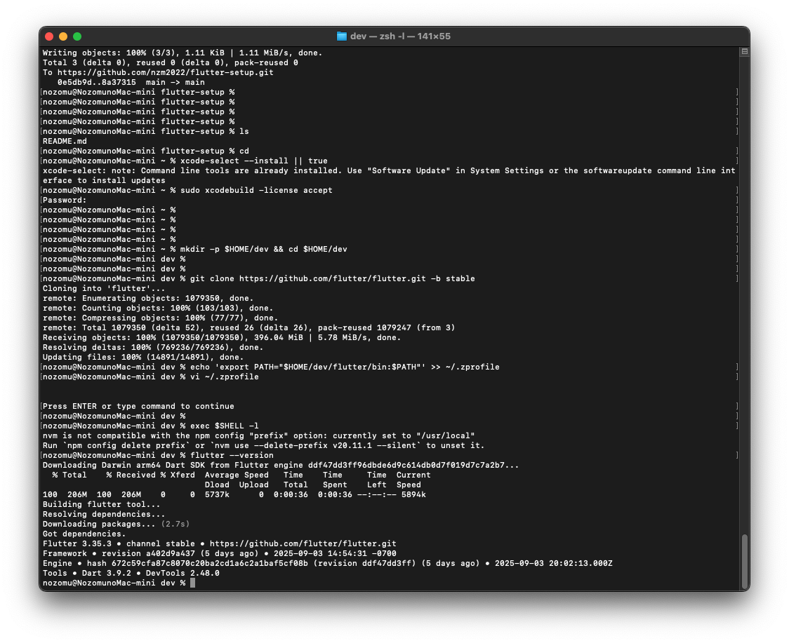
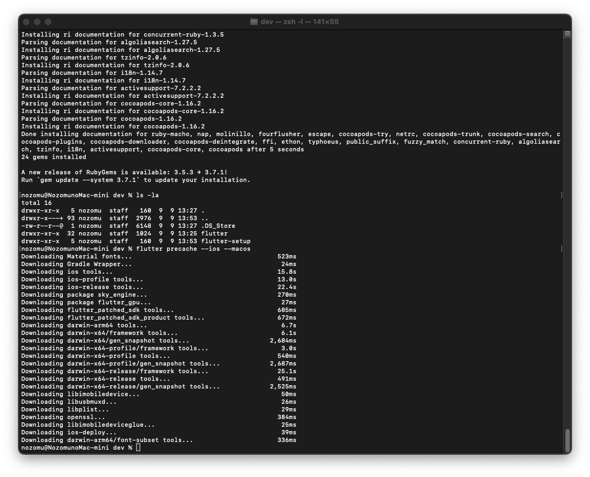
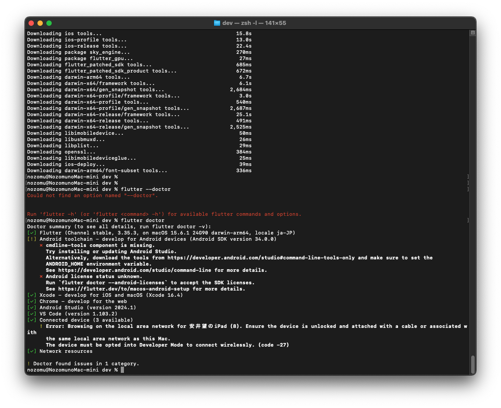
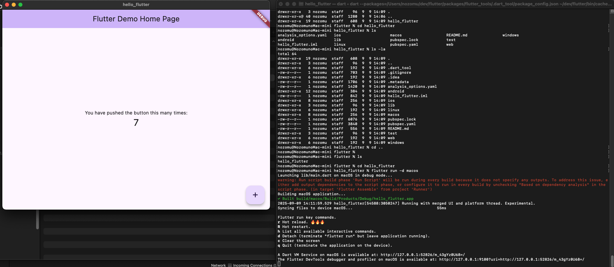
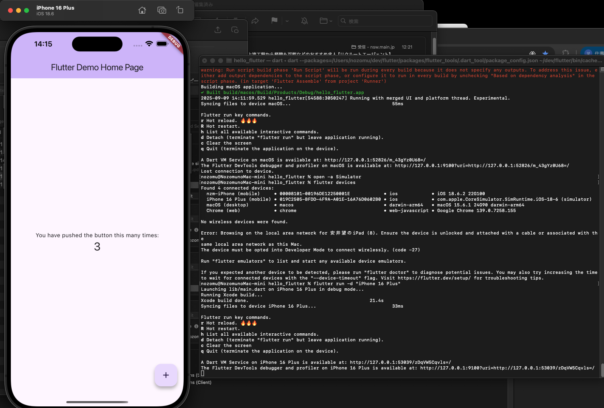

# flutter-setup
first flutter project creation and step by step

```
xcode-select --install || true
sudo xcodebuild -license accept
```

1. Flutter SDK インストール
```
mkdir -p $HOME/dev && cd $HOME/dev
git clone https://github.com/flutter/flutter.git -b stable

echo 'export PATH="$HOME/dev/flutter/bin:$PATH"' >> ~/.zprofile
exec $SHELL -l

flutter --version
```

# Flutter Setup Guide





2. iOS/macOS 用セットアップ
```
sudo gem install cocoapods
flutter precache --ios --macos
flutter doctor

flutter doctor の ❌ を順に解決。
```








3. プロジェクト作成と実行

```
cd ~
flutter create hello_flutter
cd hello_flutter


```

```# macOS 実行
flutter run -d macos
```



```# iOS シミュレータ実行
open -a Simulator
flutter devices
flutter run -d "iPhone 15"
```


4. よく使うコマンド
flutter devices                 # デバイス一覧
flutter channel                 # チャンネル確認
flutter upgrade                 # Flutter 更新
flutter clean && flutter pub get # 依存再取得


（任意）Android 開発環境
brew install --cask android-studio
brew install --cask android-platform-tools
flutter doctor --android-licenses


トラブルシュート
PATH が通らない → echo $PATH | tr : '\n' | grep flutter
CocoaPods エラー → sudo gem install cocoapods
実機 iOS で署名エラー → Xcode → Runner ターゲット → Signing & Capabilities → Team 選択
古いキャッシュ → flutter clean && flutter pub get


